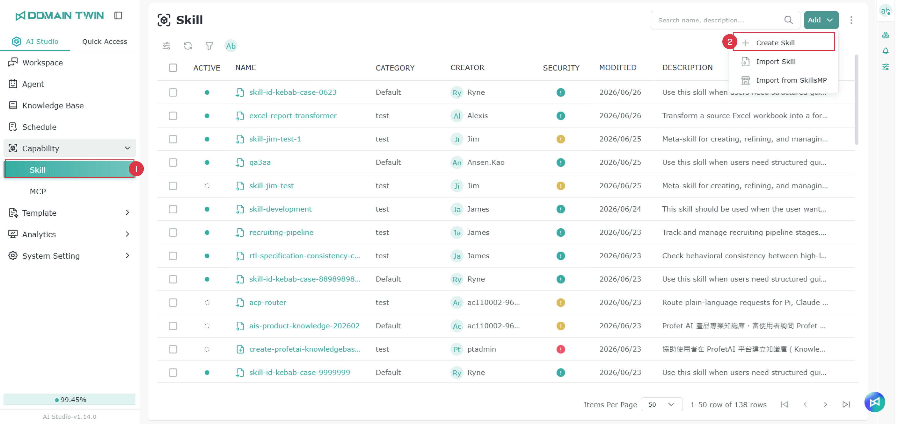

# Skills

## Introduction

By adding different Skills, an Agent can perform more specific tasks, such as retrieving external information, integrating tools, handling specific workflows, or completing operations that cannot be executed directly. Users can configure the appropriate Skills for an Agent based on users' needs, making it more flexible in responding and executing tasks, and better suited to real-world usage scenarios.

<figure><figcaption></figcaption></figure>

## Manually Add a Skill

<figure><figcaption></figcaption></figure>

<figure><figcaption></figcaption></figure>

1. Go to the Skills tab
2. Click **Add**, then select **Create**
3. Select a classification group, or click the + button on the right to add a new group
4. The left side shows the list directory. When creating a skill for the first time, a default folder and Skill.md are provided that cannot be deleted, but users can add additional folders and files. Refer to [Add Folder / File](ji-neng.md#xin-zeng-zi-liao-jia-huo-dang-an) for instructions
5. Fill in the file content according to the format
6. Click **Publish** to complete the creation

> Note: Saving does not publish the content for online use.

### Import File

Click the Import File button above the left-side list, and select the type to import: either Import File or Import Directory.

<figure><figcaption></figcaption></figure>

### Add Folder / File

Click the area above the left-side list to choose to add a file or folder, then enter a name based on the selected type.

> Note: When adding a file, users must also include the file extension, for example: readme.md.

<figure><figcaption></figcaption></figure>

### Edit / Delete Folder or File

Hover the mouse over the item users want to edit or delete — action buttons will appear on the right side. Users can click them as needed.

<figure><figcaption></figcaption></figure>

## Import Skills

<figure><figcaption></figcaption></figure>

<figure><figcaption></figcaption></figure>

1. Go to the Skills tab
2. Click **Add**, then select **Import Skills**
3. Import a file in the specified format (only **.zip, .md, .skill** are supported)
4. Select a classification group, or click the + button on the right to add a new group
5. Click **Import** to complete the creation

## Import Skills from SkillsMP

### Enable the SkillsMP Import Option

<figure><figcaption></figcaption></figure>

<figure><figcaption></figcaption></figure>

<figure><figcaption></figcaption></figure>

<figure><figcaption></figcaption></figure>

To display the SkillsMP import option in AIS, complete the following setup first:

1. Go to the official SkillsMP platform to apply for a personal or enterprise account and create an API Key
   * Application URL: [https://skillsmp.com/docs/api](https://skillsmp.com/docs/api)
2. Return to AIS and navigate to: &#x20;System Settings → Secret Key Management
3. Click **Add**
4. In the **Type** field, select: SkillsMP
5. Paste the API Key obtained from SkillsMP into the designated field
6. After completing the addition, the system will display the SkillsMP import option

> Note: The SkillsMP import feature will only appear after the API Key setup is complete. If a SkillsMP Provider and its corresponding API Key have not been added in Key Management, the system will not display the SkillsMP import option.

#### Usage Limits

The SkillsMP API applies different request limits depending on whether an API Key is used:

1. Without API Key
   * Maximum 50 requests per day
   * Maximum 10 requests per minute
   * Only keyword search is supported
2. With API Key
   * Maximum 500 requests per day
   * Maximum 30 requests per minute
   * Keyword search is supported
3. Wildcard search is not supported
   * The SkillsMP API does not support wildcard searches, for example: \*
4. Quota Usage Tracking
   * Every API response includes relevant response headers that can be used to track current quota usage

### Import Skills from SkillsMP within AIS

<figure><figcaption></figcaption></figure>

<figure><figcaption></figcaption></figure>

1. Go to the Skills tab
2. Click **Add**, then select **Import from SkillsMP**
3. Select a group
4. Select a skill, then click the + button to import

## View Security Level

After each skill is imported, the system automatically scans it and assigns a security level classification. Users can click the icon to view the details.

<figure><figcaption></figcaption></figure>

<figure><figcaption></figcaption></figure>

### Security Level Determination

The current security level determination is based on checks and evaluations according to the **OWASP Top 10 for LLM** standards.

Reference: [https://genai.owasp.org/llm-top-10/](https://genai.owasp.org/llm-top-10/)

### Skill Scan Rules

Skill Scan Rules are used to configure the model and inspection rules applied during skill scanning. This feature helps the system check whether skill content complies with platform standards when a skill is created or imported, reducing the risk of unsafe configurations, abnormal behavior, or unexpected content being used.

This feature is enabled by default. Unless there are specific requirements, it is recommended to keep the system default settings.

> If configuration is needed, the **AI Studio Administrator** can access the settings page via the following path:
>
> System Settings → Configuration → Skill Scan Settings

## Version History

AI Studio retains the version history of skills, allowing users to review past skill content and restore a skill to a specific version when needed. Users can click on a skill name in the skill list to enter the detail page and open the skill's inner page.

### View Version History

<figure><figcaption></figcaption></figure>

Click the history record icon in the top-right corner to open the Version History window. Users can view the historical versions of this Skill. The right side displays the version number, creation time, and creator information for each version; clicking any version will show a preview of that version's Skill content in the center area.

### Restore Version

<figure><figcaption></figcaption></figure>

To restore a skill to a previous version, select the version to restore in the window, confirm the content, then click **Restore**. After restoring, the system will update the current skill content to the content of the selected version. It is recommended to confirm the version content before restoring to avoid overwriting the current edits.

> Note: Restoring a version will affect the current skill content. Before proceeding, please confirm that the selected version and content meet your requirements. If multiple people co-maintain the same skill, it is recommended to confirm with the relevant maintainers before restoring.

## Using Skills

Skills can be used in two locations:

* **Agent → Skills settings on the left side**

<figure><figcaption></figcaption></figure>

<figure><figcaption></figcaption></figure>

* **Workflow → LLM Node → Skills settings**

<figure><figcaption></figcaption></figure>

<figure><figcaption></figcaption></figure>

## Permissions

For list permissions, refer to [Module Permission Role Introduction - Skills List Permissions](../ru-men-zhi-nan/quan-xian-gong-neng-jie-shao.md#ji-neng-qing-dan).

For permission settings, refer to [Permission Operations Introduction - Root Permissions](../ru-men-zhi-nan/quan-xian-cao-zuo-gong-neng-jie-shao.md#root-quan-xian).

### Skill Permissions

For role permissions, refer to [Module Permission Role Introduction - Skill Permissions](../ru-men-zhi-nan/quan-xian-gong-neng-jie-shao.md#ji-neng).

For permission settings, refer to [Permission Operations Introduction - Object Role Permissions](../ru-men-zhi-nan/quan-xian-cao-zuo-gong-neng-jie-shao.md#jue-se-quan-xian).
